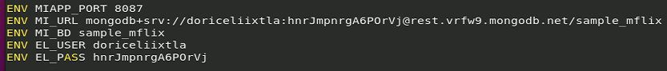
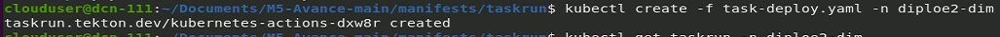
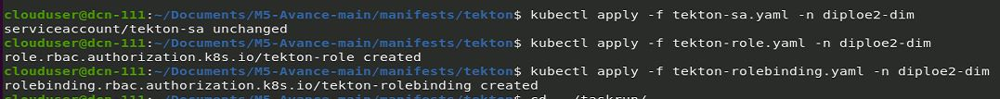

# M5-Avance-main
## Descripción del Proyecto

El proyecto M5-Avance-main es una aplicación desarrollada en Java que implementa una API RESTful para la gestión de productos en un sistema de e-commerce.

## Características principales:
- Permite a los usuarios realizar operaciones como creación, actualización y eliminación de productos.
- Gestión de pedidos con verificación de disponibilidad de productos.
- Conexión a una base de datos para almacenar y recuperar información esencial.

Además, la aplicación utiliza archivos YAML en la carpeta manifests para definir los recursos de despliegue en Kubernetes, lo que facilita la configuración y gestión del entorno de producción.

## Funcionalidad del Código Java
El núcleo de la aplicación está construido en Java y ofrece las siguientes funcionalidades:

- Gestión de Productos, registro, actualización y eliminación de usuarios.
- Manejo de autenticación y autorización con tokens JWT para asegurar el acceso a la API.
- Procesamiento de Productos, los usuarios pueden crear, actualizar y cancelar precios.

El código sigue una arquitectura Modelo-Vista-Controlador (MVC) para mantener una separación clara entre la lógica de negocio, la presentación y el acceso a datos.

## Conexión a la Base de Datos
La aplicación se conecta a una base de datos **MongoDB** (NoMySQL) para gestionar la persistencia de los datos. La configuración de la conexión se encuentra en el archivo **application.properties** ubicado en *src/main/resources/* cuyo datos se le pasan a través de Dockerfile.



## Archivos YAML y su función
Dentro de la carpeta **manifests**, encontrarás varios archivos YAML que se utilizan para definir los recursos necesarios para desplegar la aplicación en un clúster de Kubernetes.

| Archivo |	Descripción |
|---------|-------------|
|deployment.yaml|	Define el despliegue de la aplicación, especificando el número de réplicas, la imagen de Docker y las variables de entorno necesarias. También incluye la estrategia de actualización para minimizar el tiempo de inactividad.|
|service.yaml	|Configura el servicio que expone la aplicación, permitiendo el acceso desde fuera del clúster. Especifica el tipo de servicio (NodePort en entornos de desarrollo o LoadBalancer en producción).|
|configmap.yaml	|Contiene configuraciones que pueden ser inyectadas en los pods, como variables de entorno o archivos de configuración. Permite modificar parámetros sin necesidad de reconstruir la imagen de la aplicación.|
|secret.yaml|	Almacena información sensible, como credenciales de bases de datos o claves API, de manera segura y cifrada.|
|git-clone-taskrun.yaml|Copia el código del repositorio.|

# Cómo Empezar

## Configura la base de datos
Asegúrate de tener una instancia de MoboDB en funcionamiento y actualiza los parámetros de conexión en el archivo *Dockerfile*.

## Clona el repositorio
```
kubectl create -f manifest/taskrun/git-clone-taskrun.yaml
```
### task-deploy.yaml
```yaml
apiVersion: tekton.dev/v1beta1
kind: TaskRun
metadata:
  generateName: kubernetes-actions-
  namespace: diploe2-dim
spec:
  serviceAccountName: tekton-sa
  taskRef:
    name: kubernetes-actions
  params:
    - name: script
      value: |
        kubectl delete deployment avance_rest
        kubectl create deployment avance_rest --image=docker.io/doriceli/avance_rest:v4
        echo "----------"
        kubectl get deployment
  workspaces:
    - name: kubeconfig-dir
      emptyDir: {}
    - name: manifest-dir
      emptyDir: {}
```


## Despliegue en Kubernetes

Si deseas desplegar la aplicación en un clúster de Kubernetes, aplica los archivos YAML en la carpeta **manifests/tekton** y **manifest/taskrun**:

```
kubectl apply -f manifests/tekton/tekton-sa.yaml -n diploe2
kubectl apply -f manifests/tekton/tekton-role.yaml -n diploe2
kubectl apply -f manifests/tekton/tekton-rolebinding.yaml -n diploe2
kubectl create -f manifests/taskrun/task-deploy.yaml -n diploe2
```



--------------------------------------------------------------------
